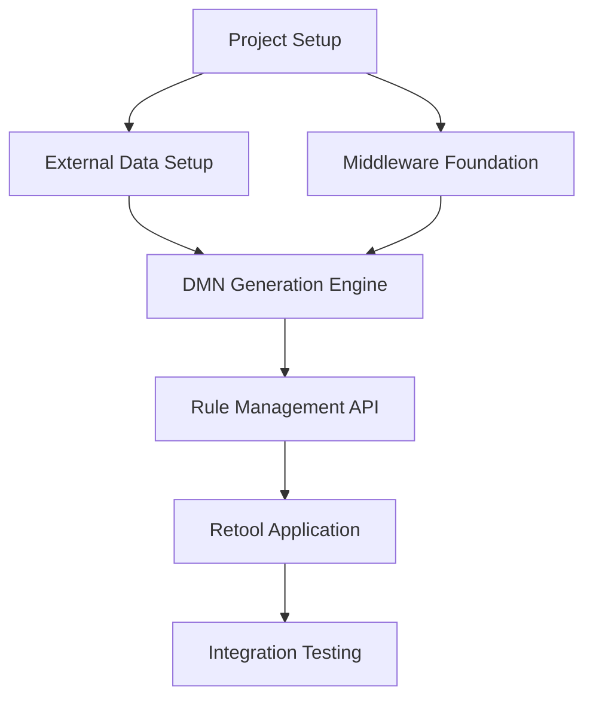

# Shrimp Task Manager Integration Guide

## 🦐 What is Shrimp Task Manager?

Shrimp Task Manager is a sophisticated task orchestration system that helps break down complex development work into manageable, executable tasks with proper dependency management and progress tracking.

## 🎯 How We Use Shrimp in This Project

### Task Planning Philosophy
- **Atomic Tasks**: Each task represents a single, completable unit of work
- **Clear Dependencies**: Tasks explicitly define what must be completed first
- **Verification Criteria**: Each task has measurable completion criteria
- **Documentation**: Tasks include implementation guides and context

### Task Categories in Our Project

#### 1. Foundation Tasks
- **Project Infrastructure Setup**: Docker, environment configuration
- **Service Architecture**: Core service implementations
- **Data Layer**: Database setup and data simulation

#### 2. Feature Implementation Tasks
- **DMN Generation**: Rule-to-XML conversion logic
- **API Development**: REST endpoint implementation
- **Integration**: Service-to-service communication

#### 3. Quality Assurance Tasks
- **Testing**: Unit, integration, and end-to-end tests
- **Documentation**: Technical and user documentation
- **Validation**: System-wide verification and testing

## 📋 Task Management Best Practices

### Task Definition Guidelines
```typescript
// Example well-defined task
{
  name: "DMN XML Generation Engine",
  description: "Implement core functionality to convert simple rule definitions into valid DMN XML format",
  implementationGuide: [
    "1. Create DMN templates for each rule type",
    "2. Implement XML generation service",
    "3. Add validation and error handling",
    "4. Create REST API endpoints"
  ],
  verificationCriteria: "Successfully generate valid DMN XML for all rule types and deploy to Camunda",
  dependencies: ["TypeScript Middleware Foundation"],
  relatedFiles: [
    { path: "src/services/dmn-generator.service.ts", type: "CREATE" },
    { path: "src/templates/dmn-templates.ts", type: "CREATE" }
  ]
}
```

### Task Sizing Guidelines
- **Small Tasks**: 1-2 days of work, single developer
- **Medium Tasks**: 3-5 days of work, may involve multiple files
- **Large Tasks**: 1 week maximum, should be split if larger
- **Epic Tasks**: Multiple related tasks with shared goals

### Dependency Management


## 🔧 Working with Shrimp Commands

### Essential Commands

#### Planning Phase
```bash
# Plan a new task with detailed requirements
shrimp-task-manager:plan_task
# Description: Complete task requirements and goals
# Requirements: Technical specifications and constraints
```

#### Analysis Phase
```bash
# Analyze task complexity and approach
shrimp-task-manager:analyze_task
# Summary: High-level task overview
# Initial Concept: Technical approach and architecture
```

#### Task Breakdown
```bash
# Split complex tasks into manageable subtasks
shrimp-task-manager:split_tasks
# Update Mode: 'clearAllTasks' for new work, 'append' for additions
# Tasks: Array of atomic, executable tasks
```

#### Execution
```bash
# Execute a specific task with guidance
shrimp-task-manager:execute_task
# Task ID: UUID of the task to execute
```

#### Quality Control
```bash
# Verify task completion against criteria
shrimp-task-manager:verify_task
# Score: 0-100 based on completion quality
# Summary: What was accomplished or what needs fixing
```

### Task Lifecycle in Our Project

1. **Planning**: Define the problem and scope
2. **Analysis**: Break down technical approach
3. **Reflection**: Review and refine the plan
4. **Splitting**: Create atomic, executable tasks
5. **Execution**: Implement according to task guidance
6. **Verification**: Validate completion against criteria
7. **Documentation**: Update project documentation

## 📊 Task Tracking and Progress

### Task Status Management
```bash
# View all tasks and their status
shrimp-task-manager:list_tasks
# Status: 'all', 'pending', 'in_progress', 'completed'

# Search for specific tasks
shrimp-task-manager:query_task
# Query: Keywords or task ID
# Page: For pagination of results

# Get detailed task information
shrimp-task-manager:get_task_detail
# Task ID: Specific task to examine
```

### Progress Monitoring
- **Completion Rate**: Percentage of tasks completed
- **Velocity**: Tasks completed per time period
- **Dependency Blocking**: Tasks waiting on dependencies
- **Quality Metrics**: Average verification scores

## 🎯 Project-Specific Task Patterns

### Service Implementation Pattern
```typescript
// Typical service implementation task breakdown
1. Interface Definition
   - Define TypeScript interfaces
   - Specify method signatures
   - Document expected behavior

2. Core Implementation
   - Implement main service logic
   - Add error handling
   - Include logging and monitoring

3. Testing
   - Unit tests for all methods
   - Integration tests with dependencies
   - Error case validation

4. Documentation
   - API documentation
   - Usage examples
   - Integration guides
```

### API Endpoint Pattern
```typescript
// REST API development task structure
1. Controller Implementation
   - Request/response handling
   - Input validation
   - Error responses

2. Service Integration
   - Business logic delegation
   - Data transformation
   - Result formatting

3. Testing Suite
   - Endpoint testing
   - Authentication/authorization
   - Error handling validation

4. Documentation
   - OpenAPI specifications
   - Example requests/responses
   - Error code documentation
```

## 🔍 Troubleshooting Shrimp Integration

### Common Issues

#### Task Dependencies Not Clear
```bash
# Solution: Use query_task to understand relationships
shrimp-task-manager:query_task
# Then update task with proper dependencies
shrimp-task-manager:update_task
```

#### Task Too Large or Complex
```bash
# Solution: Split into smaller, atomic tasks
shrimp-task-manager:split_tasks
# Use granularity guidelines (1-2 days max per task)
```

#### Verification Failing
```bash
# Solution: Review verification criteria
shrimp-task-manager:get_task_detail
# Update implementation to match criteria
# Re-verify with corrected implementation
shrimp-task-manager:verify_task
```

### Best Practices for Task Management

1. **Clear Acceptance Criteria**: Each task should have measurable success criteria
2. **Atomic Operations**: Tasks should be indivisible units of work
3. **Proper Dependencies**: Explicitly define what must be completed first
4. **Regular Updates**: Keep task status current as work progresses
5. **Quality Gates**: Don't mark tasks complete until verification passes

## 📈 Metrics and Reporting

### Task Completion Metrics
- **Completion Rate**: `completed_tasks / total_tasks * 100`
- **Quality Score**: Average verification scores across all tasks
- **Dependency Efficiency**: Tasks completed without dependency blocking
- **Rework Rate**: Tasks requiring multiple verification attempts

### Progress Reporting
```bash
# Generate progress report
shrimp-task-manager:list_tasks
# Analyze completion rates by category
# Identify bottlenecks and blockers
# Plan next sprint priorities
```

## 🚀 Advanced Shrimp Features

### Research Mode
```bash
# For complex investigation tasks
shrimp-task-manager:research_mode
# Topic: Specific technical area to research
# Current State: What you're currently investigating
# Next Steps: Planned research direction
```

### Batch Operations
```bash
# Process multiple related tasks
shrimp-task-manager:split_tasks
# Use 'batch' update mode for related task groups
# Maintain consistency across task sets
```

### Project Standards Integration
```bash
# Initialize project-specific standards
shrimp-task-manager:init_project_rules
# Establishes coding standards and practices
# Ensures consistency across all tasks
```

## 📚 Integration with Project Documentation

### Task Documentation Requirements
- **Architecture Compliance**: Tasks must follow ARCHITECTURE.md guidelines
- **Implementation Standards**: Adhere to IMPLEMENTATION_GUIDE.md patterns
- **Roadmap Alignment**: Tasks should advance ROADMAP.md goals
- **Quality Gates**: Meet all verification criteria before completion

### Documentation Updates
When completing tasks:
1. Update relevant documentation files
2. Add new patterns to implementation guide
3. Update roadmap progress
4. Document any architectural decisions
5. Do not create new documentation without explicit approval
---

## ✅ Shrimp Integration Checklist

### Before Starting New Work
- [ ] Review existing tasks and dependencies
- [ ] Plan new tasks with clear criteria
- [ ] Analyze complexity and split if needed
- [ ] Document task relationships

### During Task Execution
- [ ] Follow task implementation guide
- [ ] Update task status regularly
- [ ] Document any scope changes
- [ ] Test against verification criteria

### After Task Completion
- [ ] Verify task meets all criteria
- [ ] Update project documentation
- [ ] Review lessons learned
- [ ] Plan next related tasks

**Remember**: Shrimp Task Manager is a tool to help organize and track work. The key to success is breaking down complex problems into manageable, well-defined tasks with clear success criteria.
