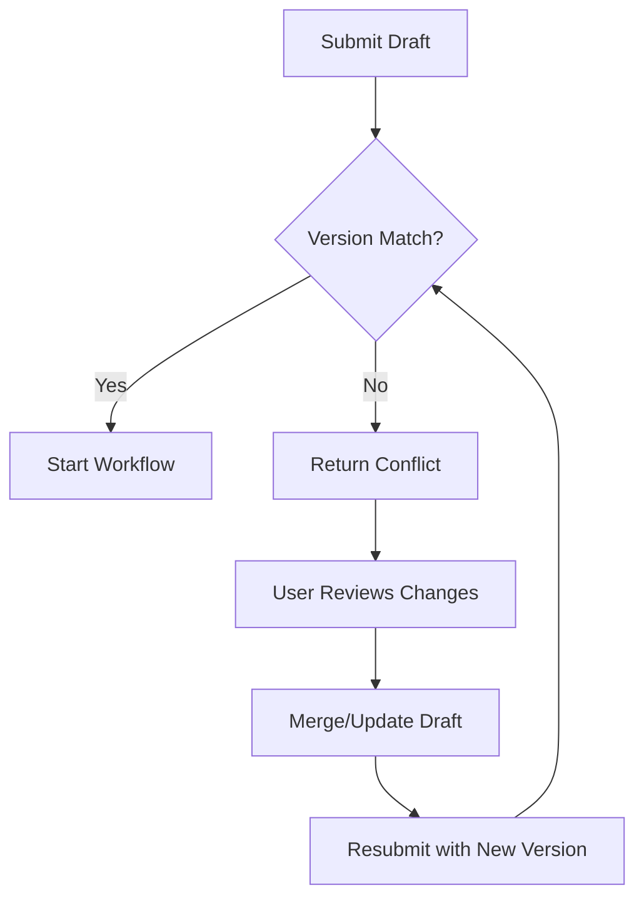

# Orchestration API Documentation

---
**Document Metadata**
- **Version:** 2.0.0
- **Last Modified:** 2025-01-08
- **API Version:** v1
- **Status:** Active - Stateless Architecture
- **OpenAPI Spec:** `/api/docs` (Swagger UI)
---

## Overview

The Orchestration API provides a **stateless coordination layer** for managing benefit plan approval workflows. Following microservices best practices, the orchestration service maintains no internal state, delegating all data persistence to specialized services.

## Architecture Principles

### Stateless Design
The orchestration service operates as a pure coordination layer without its own database:

```
┌────────────────────────────────────────────────┐
│           Orchestration Service                 │
│         (Stateless Coordinator)                 │
└──────────┬─────────────┬──────────┬────────────┘
           │             │          │
    ┌──────▼──────┐ ┌───▼────┐ ┌──▼────┐
    │   Retool    │ │ Camunda │ │ Aidbox │
    │  (Drafts)   │ │(Workflow)││(Approved)│
    └─────────────┘ └─────────┘ └─────────┘
```

### Data Ownership

| Service | Responsibility | Data Stored |
|---------|---------------|-------------|
| **Retool** | Draft Management | Unsaved edits, draft plans |
| **Camunda** | Workflow State | Approval status, process instances |
| **Aidbox** | Source of Truth | Approved plans, final data |
| **Orchestration** | Coordination Only | No persistent data as of now |

## Base URL

```
Development: http://localhost:3000/api
```

## Authentication

All API requests require authentication via API key:

```http
X-API-Key: your-api-key-here
```

## API Endpoints

### Plan Management

#### Get Plan
Retrieves a plan directly from Aidbox (source of truth).

```http
GET /api/plans/:id
```

**Response:**
```json
{
  "success": true,
  "data": {
    "id": "plan-123",
    "name": "Premium Health Plan",
    "status": "approved",
    "version": 3,
    "lastModified": "2025-01-08T10:00:00Z",
    "details": { /* plan configuration */ }
  }
}
```

#### Submit Plan for Approval
Initiates the approval workflow for a plan. The orchestration service coordinates between Retool (draft), Camunda (workflow), and Aidbox (final storage).

```http
POST /api/plans/:id/submit
```

**Request Body:**
```json
{
  "planData": { /* optional latest plan data */ },
  "userId": "user-456"
}
```

**Response:**
```json
{
  "success": true,
  "message": "Plan submitted for approval",
  "data": {
    "processInstanceId": "process-789",
    "planId": "plan-123",
    "status": "pending_approval"
  }
}
```

**Error Responses:**

- `409 Conflict`: Plan is already in approval process
- `404 Not Found`: Plan does not exist
- `400 Bad Request`: Invalid request data

#### Get Plan Status
Retrieves the current approval status from Camunda workflow engine.

```http
GET /api/plans/:id/status
```

**Response:**
```json
{
  "success": true,
  "data": {
    "planId": "plan-123",
    "status": "pending_approval",
    "currentStep": "manager_review",
    "assignee": "manager@example.com",
    "startedAt": "2025-01-08T09:00:00Z"
  }
}
```

#### List Plans
Lists all plans with their current approval status.

```http
GET /api/plans
```

**Query Parameters:**
- `status` (optional): Filter by status (draft, pending, approved, rejected)
- `page` (optional): Page number for pagination
- `limit` (optional): Items per page

**Response:**
```json
{
  "success": true,
  "data": {
    "plans": [
      {
        "id": "plan-123",
        "name": "Premium Health Plan",
        "status": "approved",
        "version": 3,
        "lastModified": "2025-01-08T10:00:00Z"
      }
    ],
    "total": 42,
    "page": 1,
    "pageSize": 10
  }
}
```

### Draft Management

#### Check Version Conflict
Checks if there's a version conflict before submitting for approval.

```http
GET /api/drafts/:id/check-conflict
```

**Response:**
```json
{
  "success": true,
  "data": {
    "hasConflict": false,
    "draftVersion": 2,
    "currentVersion": 2
  }
}
```

**Conflict Response:**
```json
{
  "success": true,
  "data": {
    "hasConflict": true,
    "draftVersion": 2,
    "currentVersion": 3,
    "conflictType": "version_mismatch",
    "resolution": "Please review and merge changes"
  }
}
```

#### Resubmit Draft
Resubmits a draft after resolving version conflicts.

```http
POST /api/drafts/:id/resubmit
```

**Request Body:**
```json
{
  "userId": "user-456"
}
```

**Response:**
```json
{
  "success": true,
  "message": "Draft resubmitted successfully",
  "data": {
    "processInstanceId": "process-890",
    "draftId": "draft-123",
    "newVersion": 4
  }
}
```

#### List Drafts
Lists all drafts with their workflow status.

```http
GET /api/drafts
```

**Query Parameters:**
- `userId` (optional): Filter by user ID

**Response:**
```json
{
  "success": true,
  "data": {
    "drafts": [
      {
        "id": "draft-123",
        "planId": "plan-456",
        "status": "in_review",
        "createdBy": "user-789",
        "createdAt": "2025-01-07T14:00:00Z",
        "baseVersion": 2
      }
    ]
  }
}
```

### Task Management

#### Get Pending Tasks
Retrieves pending approval tasks for a specific user.

```http
GET /api/tasks?userId=user-456
```

**Response:**
```json
{
  "success": true,
  "data": {
    "tasks": [
      {
        "id": "task-123",
        "planId": "plan-456",
        "planName": "Premium Health Plan",
        "type": "approval",
        "priority": "high",
        "assignedTo": "user-456",
        "createdAt": "2025-01-08T08:00:00Z",
        "dueDate": "2025-01-10T17:00:00Z"
      }
    ],
    "total": 5
  }
}
```

#### Complete Task
Completes an approval task (approve or reject).

```http
POST /api/tasks/:id/complete
```

**Request Body:**
```json
{
  "approved": true,
  "comments": "Looks good, approved for implementation",
  "userId": "user-456"
}
```

**Response:**
```json
{
  "success": true,
  "message": "Task completed successfully",
  "data": {
    "taskId": "task-123",
    "result": "approved",
    "nextStep": "final_review",
    "processStatus": "in_progress"
  }
}
```

**Version Conflict Response (409):**
```json
{
  "success": false,
  "error": "version_conflict",
  "conflictType": "concurrent_modification",
  "message": "Plan was modified during approval",
  "data": {
    "currentVersion": 4,
    "approvedVersion": 3,
    "requiresReview": true
  }
}
```

### Health Check

#### Service Health
Checks the health status of the orchestration service.

```http
GET /api/health
```

**Response:**
```json
{
  "success": true,
  "status": "healthy",
  "service": "orchestration-api",
  "timestamp": "2025-01-08T12:00:00Z",
  "dependencies": {
    "retool": "healthy",
    "camunda": "healthy",
    "aidbox": "healthy"
  }
}
```

## Error Handling

### Standard Error Response

All errors follow a consistent format:

```json
{
  "success": false,
  "error": "ERROR_CODE",
  "message": "Human-readable error message",
  "details": { /* Additional error context */ },
  "timestamp": "2025-01-08T12:00:00Z"
}
```

### Common Error Codes

| Code | HTTP Status | Description |
|------|------------|-------------|
| `VALIDATION_ERROR` | 400 | Invalid request data |
| `NOT_FOUND` | 404 | Resource not found |
| `VERSION_CONFLICT` | 409 | Version mismatch detected |
| `ALREADY_EXISTS` | 409 | Resource already exists |
| `UNAUTHORIZED` | 401 | Missing authentication |
| `FORBIDDEN` | 403 | Insufficient permissions |
| `INTERNAL_ERROR` | 500 | Server error |
| `SERVICE_UNAVAILABLE` | 503 | Dependency unavailable |

## Version Conflict Resolution

The stateless architecture implements optimistic locking for version control:

### Conflict Detection
1. Draft stores base version when editing starts
2. On submission, compares with current Aidbox version
3. Detects conflicts before workflow initiation

### Resolution Flow


### Example: Handling Version Conflicts

```javascript
// 1. Check for conflicts before submission
const conflictCheck = await fetch(`/api/drafts/${draftId}/check-conflict`);
const { hasConflict, conflictType } = await conflictCheck.json();

if (hasConflict) {
  // 2. Handle based on conflict type
  switch (conflictType) {
    case 'version_mismatch':
      // Show merge UI
      await showMergeDialog(draftId);
      break;
    case 'plan_deleted':
      // Handle deletion
      await handleDeletedPlan(draftId);
      break;
  }
} else {
  // 3. Safe to submit
  await submitForApproval(draftId);
}
```

## Workflow States

The approval workflow managed by Camunda has the following states:

| State | Description | Next States |
|-------|-------------|-------------|
| `draft` | Initial state in Retool | `pending_approval` |
| `pending_approval` | Awaiting first approval | `approved`, `rejected`, `needs_revision` |
| `needs_revision` | Returned for changes | `pending_approval`, `cancelled` |
| `approved` | Approved, saved to Aidbox | `published` |
| `rejected` | Rejected by approver | `draft`, `archived` |
| `published` | Active in production | `deprecated` |

## Rate Limiting

API endpoints are rate-limited to ensure service stability:

| Endpoint Type | Limit | Window |
|--------------|-------|--------|
| Read Operations | 1000 req | 1 minute |
| Write Operations | 100 req | 1 minute |
| Bulk Operations | 10 req | 1 minute |

Rate limit headers are included in responses:
```http
X-RateLimit-Limit: 1000
X-RateLimit-Remaining: 950
X-RateLimit-Reset: 1704716400
```

## Integration Examples

### JavaScript/TypeScript

```typescript
import axios from 'axios';

class OrchestrationClient {
  private baseURL: string;
  private apiKey: string;

  constructor(baseURL: string, apiKey: string) {
    this.baseURL = baseURL;
    this.apiKey = apiKey;
  }

  async submitPlan(planId: string, userId: string) {
    try {
      const response = await axios.post(
        `${this.baseURL}/plans/${planId}/submit`,
        { userId },
        {
          headers: {
            'X-API-Key': this.apiKey,
            'Content-Type': 'application/json'
          }
        }
      );
      return response.data;
    } catch (error) {
      if (error.response?.status === 409) {
        // Handle version conflict
        return this.handleVersionConflict(planId, userId);
      }
      throw error;
    }
  }

  private async handleVersionConflict(planId: string, userId: string) {
    // Check conflict details
    const conflict = await this.checkConflict(planId);
    
    // Notify user and get resolution
    const resolution = await this.promptUserForResolution(conflict);
    
    if (resolution === 'merge') {
      // Resubmit with updated version
      return this.resubmit(planId, userId);
    }
    
    throw new Error('Version conflict requires manual resolution');
  }
}
```

### Python

```python
import requests
from typing import Dict, Optional

class OrchestrationAPI:
    def __init__(self, base_url: str, api_key: str):
        self.base_url = base_url
        self.api_key = api_key
        self.session = requests.Session()
        self.session.headers.update({'X-API-Key': api_key})
    
    def submit_plan(self, plan_id: str, user_id: str, 
                   plan_data: Optional[Dict] = None) -> Dict:
        """Submit a plan for approval workflow."""
        payload = {'userId': user_id}
        if plan_data:
            payload['planData'] = plan_data
        
        response = self.session.post(
            f"{self.base_url}/plans/{plan_id}/submit",
            json=payload
        )
        
        if response.status_code == 409:
            # Handle conflict
            return self._handle_conflict(plan_id, user_id)
        
        response.raise_for_status()
        return response.json()
    
    def _handle_conflict(self, plan_id: str, user_id: str) -> Dict:
        """Handle version conflicts during submission."""
        # Check conflict details
        conflict = self.check_version_conflict(plan_id)
        
        if conflict['data']['hasConflict']:
            # Attempt resubmission with updated version
            return self.resubmit_draft(plan_id, user_id)
        
        return conflict
```

## Testing

### Test Environment
```
Base URL: http://localhost:3000/api
Test API Key: test-api-key-12345
```

### Sample Test Data

```json
{
  "testPlan": {
    "id": "test-plan-001",
    "name": "Test Premium Plan",
    "configuration": {
      "coverage": "comprehensive",
      "deductible": 1000,
      "maxBenefit": 1000000
    }
  },
  "testUser": {
    "id": "test-user-001",
    "email": "test@example.com",
    "role": "manager"
  }
}
```

### Postman Collection

A complete Postman collection is available at:
```
docs/api/orchestration-api.postman_collection.json
```

## Migration Guide

### From Stateful to Stateless

If migrating from a previous stateful implementation:

1. **Data Migration**: Ensure all plan data is in Aidbox
2. **Workflow State**: Migrate active workflows to Camunda
3. **Draft Handling**: Move drafts to Retool database
4. **Remove Dependencies**: Update code to remove orchestration DB references
5. **Update API Calls**: Use new stateless endpoints

### Breaking Changes

- Orchestration service no longer stores plan data
- All plan queries go directly to Aidbox
- Workflow state managed entirely by Camunda
- Version conflicts handled via optimistic locking

## Support

For API support and questions:
- **Documentation**: This document
- **OpenAPI Spec**: `/api/docs`
- **Issues**: GitHub repository
- **Contact**: api-support@example.com

---

**Note**: This documentation reflects the stateless orchestration pattern implemented in v2.0.0. The orchestration service acts purely as a coordinator between Retool, Camunda, and Aidbox without maintaining its own state.