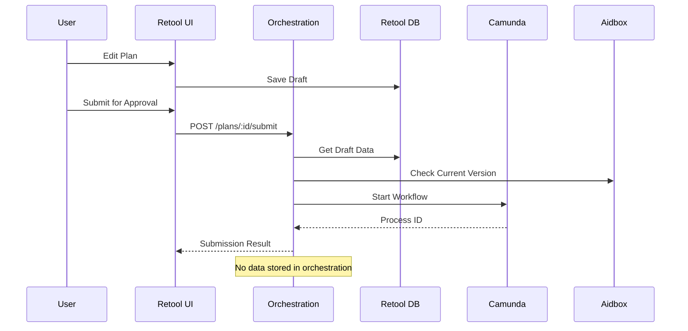

# Stateless Orchestration Pattern - Implementation Examples

## Overview

This document provides practical examples of implementing the stateless orchestration pattern, demonstrating how the service coordinates between Retool, Camunda, and Aidbox without maintaining its own state.

## Architecture Diagram



## Implementation Examples

### 1. Stateless Service Implementation (TypeScript)

```typescript
// stateless-orchestration.service.ts
import { Injectable } from '@nestjs/common';
import { RetoolDraftService } from './retool-draft.service';
import { CamundaService } from './camunda.service';
import { AidboxService } from './aidbox.service';

@Injectable()
export class StatelessOrchestrationService {
  constructor(
    private retoolDraft: RetoolDraftService,
    private camunda: CamundaService,
    private aidbox: AidboxService
  ) {}

  /**
   * Submit plan for approval - stateless coordination
   * No data is stored in the orchestration service
   */
  async submitForApproval(planId: string, userId: string) {
    try {
      // 1. Fetch draft from Retool (not stored locally)
      const draft = await this.retoolDraft.getDraft(planId);
      
      if (!draft) {
        return {
          success: false,
          error: 'Draft not found in Retool'
        };
      }

      // 2. Check current version in Aidbox (source of truth)
      const currentPlan = await this.aidbox.getPlan(planId);
      
      // 3. Detect version conflicts
      if (currentPlan && draft.baseVersion !== currentPlan.version) {
        return {
          success: false,
          error: 'version_conflict',
          conflictType: 'concurrent_modification',
          data: {
            draftVersion: draft.baseVersion,
            currentVersion: currentPlan.version
          }
        };
      }

      // 4. Start workflow in Camunda (workflow state managed by Camunda)
      const processInstance = await this.camunda.startProcess('plan-approval', {
        planId,
        userId,
        draftData: draft.data,
        version: draft.baseVersion
      });

      // 5. Update draft status in Retool (not locally)
      await this.retoolDraft.updateStatus(planId, 'in_approval');

      // Return result without storing anything
      return {
        success: true,
        data: {
          processInstanceId: processInstance.id,
          status: 'pending_approval'
        }
      };
    } catch (error) {
      // Log error but don't store state
      console.error('Submission error:', error);
      throw error;
    }
  }

  /**
   * Get plan status - queries external services
   */
  async getPlanStatus(planId: string) {
    // Check workflow status in Camunda
    const workflowStatus = await this.camunda.getProcessStatus(planId);
    
    // Get plan data from Aidbox
    const plan = await this.aidbox.getPlan(planId);
    
    // Combine information without storing
    return {
      success: true,
      data: {
        planId,
        planStatus: plan?.status || 'not_found',
        workflowStatus: workflowStatus?.state || 'no_workflow',
        currentStep: workflowStatus?.currentTask,
        version: plan?.version
      }
    };
  }

  /**
   * Complete approval task - coordinates services
   */
  async completeApprovalTask(
    taskId: string, 
    approved: boolean, 
    comments: string,
    userId: string
  ) {
    // 1. Get task details from Camunda
    const task = await this.camunda.getTask(taskId);
    
    if (!task) {
      return {
        success: false,
        error: 'Task not found'
      };
    }

    // 2. Check for version conflicts
    const draft = await this.retoolDraft.getDraft(task.planId);
    const currentPlan = await this.aidbox.getPlan(task.planId);
    
    if (draft.baseVersion !== currentPlan.version) {
      // Version changed during approval
      return {
        success: false,
        error: 'version_conflict',
        message: 'Plan was modified during approval process'
      };
    }

    // 3. Complete task in Camunda
    await this.camunda.completeTask(taskId, {
      approved,
      comments,
      completedBy: userId
    });

    // 4. If approved, save to Aidbox
    if (approved) {
      await this.aidbox.savePlan({
        ...draft.data,
        id: task.planId,
        version: currentPlan.version + 1,
        approvedBy: userId,
        approvedAt: new Date()
      });
      
      // Update draft status in Retool
      await this.retoolDraft.updateStatus(task.planId, 'approved');
    } else {
      // Update draft status for rejection
      await this.retoolDraft.updateStatus(task.planId, 'rejected');
    }

    return {
      success: true,
      data: {
        taskId,
        result: approved ? 'approved' : 'rejected'
      }
    };
  }
}
```

### 2. Controller Without Database Dependencies

```typescript
// orchestration.controller.ts
import { Controller, Get, Post, Param, Body, Query } from '@nestjs/common';
import { StatelessOrchestrationService } from './stateless-orchestration.service';

@Controller('api')
export class OrchestrationController {
  constructor(
    private orchestration: StatelessOrchestrationService
  ) {}

  @Get('health')
  async healthCheck() {
    // No database to check - only service dependencies
    return {
      success: true,
      status: 'healthy',
      service: 'orchestration-api',
      timestamp: new Date().toISOString(),
      note: 'Stateless service - no database'
    };
  }

  @Post('plans/:id/submit')
  async submitPlan(
    @Param('id') planId: string,
    @Body() body: { userId: string; planData?: any }
  ) {
    // Coordinate submission without storing data
    return this.orchestration.submitForApproval(planId, body.userId);
  }

  @Get('plans/:id/status')
  async getPlanStatus(@Param('id') planId: string) {
    // Query status from external services
    return this.orchestration.getPlanStatus(planId);
  }
}
```

### 3. Version Conflict Resolution Flow

```typescript
// version-conflict-handler.ts
export class VersionConflictHandler {
  /**
   * Handle version conflicts during submission
   */
  async handleSubmissionWithConflict(
    planId: string,
    userId: string,
    retoolDraft: RetoolDraftService,
    aidbox: AidboxService
  ) {
    // 1. Detect conflict
    const draft = await retoolDraft.getDraft(planId);
    const current = await aidbox.getPlan(planId);
    
    if (draft.baseVersion !== current.version) {
      // 2. Get changes from both versions
      const draftChanges = this.extractChanges(draft.originalData, draft.data);
      const currentChanges = this.extractChanges(draft.originalData, current.data);
      
      // 3. Check if changes conflict
      const hasRealConflict = this.detectRealConflicts(draftChanges, currentChanges);
      
      if (!hasRealConflict) {
        // 4. Auto-merge if no real conflicts
        const merged = this.autoMerge(draft.data, current.data, draftChanges);
        
        // 5. Update draft with new base version
        await retoolDraft.updateDraft(planId, {
          data: merged,
          baseVersion: current.version,
          autoMerged: true
        });
        
        return {
          success: true,
          action: 'auto_merged',
          newVersion: current.version
        };
      } else {
        // 6. Require manual resolution
        return {
          success: false,
          action: 'manual_merge_required',
          conflicts: this.getConflictDetails(draftChanges, currentChanges)
        };
      }
    }
    
    // No conflict
    return { success: true, action: 'no_conflict' };
  }

  private extractChanges(original: any, modified: any): Map<string, any> {
    const changes = new Map();
    // Implementation to detect what fields changed
    return changes;
  }

  private detectRealConflicts(
    draftChanges: Map<string, any>,
    currentChanges: Map<string, any>
  ): boolean {
    // Check if same fields were modified differently
    for (const [field, draftValue] of draftChanges) {
      if (currentChanges.has(field)) {
        const currentValue = currentChanges.get(field);
        if (JSON.stringify(draftValue) !== JSON.stringify(currentValue)) {
          return true; // Real conflict found
        }
      }
    }
    return false;
  }

  private autoMerge(draft: any, current: any, draftChanges: Map<string, any>): any {
    // Start with current version
    const merged = { ...current };
    
    // Apply non-conflicting draft changes
    for (const [field, value] of draftChanges) {
      merged[field] = value;
    }
    
    return merged;
  }
}
```

### 4. Client-Side Implementation

```javascript
// orchestration-client.js
class OrchestrationClient {
  constructor(apiUrl, apiKey) {
    this.apiUrl = apiUrl;
    this.apiKey = apiKey;
  }

  /**
   * Submit plan with automatic conflict handling
   */
  async submitPlanWithConflictHandling(planId, userId) {
    try {
      // 1. Check for conflicts first
      const conflictCheck = await this.checkConflict(planId);
      
      if (conflictCheck.data.hasConflict) {
        // 2. Handle conflict based on type
        if (conflictCheck.data.conflictType === 'version_mismatch') {
          // Try to resubmit with updated version
          const resubmit = await this.resubmitDraft(planId, userId);
          
          if (resubmit.success) {
            return {
              success: true,
              message: 'Submitted after resolving conflict',
              processId: resubmit.data.processInstanceId
            };
          } else {
            // Manual intervention required
            return {
              success: false,
              requiresManualMerge: true,
              conflictDetails: resubmit.data
            };
          }
        }
      }
      
      // 3. No conflict - proceed with normal submission
      const response = await fetch(`${this.apiUrl}/plans/${planId}/submit`, {
        method: 'POST',
        headers: {
          'X-API-Key': this.apiKey,
          'Content-Type': 'application/json'
        },
        body: JSON.stringify({ userId })
      });
      
      return await response.json();
    } catch (error) {
      console.error('Submission error:', error);
      throw error;
    }
  }

  async checkConflict(draftId) {
    const response = await fetch(
      `${this.apiUrl}/drafts/${draftId}/check-conflict`,
      {
        headers: { 'X-API-Key': this.apiKey }
      }
    );
    return await response.json();
  }

  async resubmitDraft(draftId, userId) {
    const response = await fetch(
      `${this.apiUrl}/drafts/${draftId}/resubmit`,
      {
        method: 'POST',
        headers: {
          'X-API-Key': this.apiKey,
          'Content-Type': 'application/json'
        },
        body: JSON.stringify({ userId })
      }
    );
    return await response.json();
  }
}

// Usage example
const client = new OrchestrationClient('http://localhost:3000/api', 'api-key');

async function submitPlan() {
  const result = await client.submitPlanWithConflictHandling('plan-123', 'user-456');
  
  if (result.success) {
    console.log('Plan submitted successfully:', result.processId);
  } else if (result.requiresManualMerge) {
    console.log('Manual merge required:', result.conflictDetails);
    // Show merge UI to user
  } else {
    console.error('Submission failed:', result.error);
  }
}
```

### 5. Docker Compose Configuration (No Orchestration DB)

```yaml
# docker-compose.yml - Stateless architecture
version: '3.8'

services:
  orchestration-api:
    build: ./middleware
    ports:
      - "3000:3000"
    environment:
      - NODE_ENV=production
      - RETOOL_API_URL=http://retool:3000
      - CAMUNDA_API_URL=http://camunda:8080
      - AIDBOX_API_URL=http://aidbox:8080
      # Note: No database connection string needed
    depends_on:
      - retool-db
      - camunda
      - aidbox
    # No volume mounts for data persistence

  retool-db:
    image: postgres:14
    environment:
      POSTGRES_DB: retool
      POSTGRES_USER: retool
      POSTGRES_PASSWORD: retool_password
    volumes:
      - retool-data:/var/lib/postgresql/data

  camunda:
    image: camunda/camunda-bpm-platform:latest
    ports:
      - "8080:8080"
    environment:
      - DB_DRIVER=org.postgresql.Driver
      - DB_URL=jdbc:postgresql://camunda-db:5432/camunda
      - DB_USERNAME=camunda
      - DB_PASSWORD=camunda_password

  camunda-db:
    image: postgres:14
    environment:
      POSTGRES_DB: camunda
      POSTGRES_USER: camunda
      POSTGRES_PASSWORD: camunda_password
    volumes:
      - camunda-data:/var/lib/postgresql/data

  aidbox:
    image: healthsamurai/aidboxone:latest
    ports:
      - "8888:8080"
    environment:
      AIDBOX_LICENSE: ${AIDBOX_LICENSE}
      AIDBOX_BASE_URL: http://aidbox:8080
    volumes:
      - aidbox-data:/var/lib/postgresql/data

volumes:
  retool-data:
  camunda-data:
  aidbox-data:
  # Note: No orchestration-data volume
```

## Benefits of Stateless Pattern

1. **Scalability**: Service instances can be added/removed without data synchronization
2. **Reliability**: No data loss if orchestration service fails
3. **Simplicity**: No database migrations or data management in orchestration
4. **Performance**: No database bottleneck in orchestration layer
5. **Maintainability**: Clear separation of concerns

## Migration Checklist

When migrating from stateful to stateless:

- [ ] Remove all database connections from orchestration service
- [ ] Update health checks to not check database status
- [ ] Ensure all data queries go to appropriate services (Retool/Camunda/Aidbox)
- [ ] Update deployment configs to remove database volumes
- [ ] Modify error handling to not rely on transaction rollbacks
- [ ] Update monitoring to track service calls instead of database metrics
- [ ] Document new data flow for team members
- [ ] Update integration tests to mock external services

## Testing the Stateless Pattern

```javascript
// test-stateless-orchestration.spec.js
describe('Stateless Orchestration', () => {
  it('should not store any data locally', async () => {
    // Mock external services
    const retoolMock = jest.fn().mockResolvedValue({ draft: {...} });
    const camundaMock = jest.fn().mockResolvedValue({ processId: '123' });
    const aidboxMock = jest.fn().mockResolvedValue({ plan: {...} });
    
    // Create service with mocks
    const service = new StatelessOrchestrationService(
      retoolMock,
      camundaMock,
      aidboxMock
    );
    
    // Execute operation
    await service.submitForApproval('plan-1', 'user-1');
    
    // Verify no local storage occurred
    expect(service.database).toBeUndefined();
    expect(service.cache).toBeUndefined();
    
    // Verify external services were called
    expect(retoolMock).toHaveBeenCalled();
    expect(camundaMock).toHaveBeenCalled();
    expect(aidboxMock).toHaveBeenCalled();
  });
});
```

## Monitoring and Observability

Since the orchestration service is stateless, monitoring focuses on:

1. **Service Health**: External service availability
2. **Request Metrics**: Latency, throughput, error rates
3. **Dependency Tracking**: Which services are called
4. **Version Conflicts**: Frequency and resolution patterns

```javascript
// monitoring.js
class StatelessMonitoring {
  trackServiceCall(service, operation, duration, success) {
    // Send metrics to monitoring system
    metrics.record({
      service: 'orchestration',
      dependency: service,
      operation: operation,
      duration: duration,
      success: success,
      timestamp: Date.now()
    });
  }

  trackVersionConflict(planId, conflictType) {
    // Track conflict patterns
    metrics.increment('version_conflicts', {
      type: conflictType,
      planId: planId
    });
  }
}
```

## Conclusion

The stateless orchestration pattern provides a clean, scalable architecture for managing complex workflows across multiple services. By delegating all state management to specialized services, the orchestration layer remains simple, maintainable, and highly available.